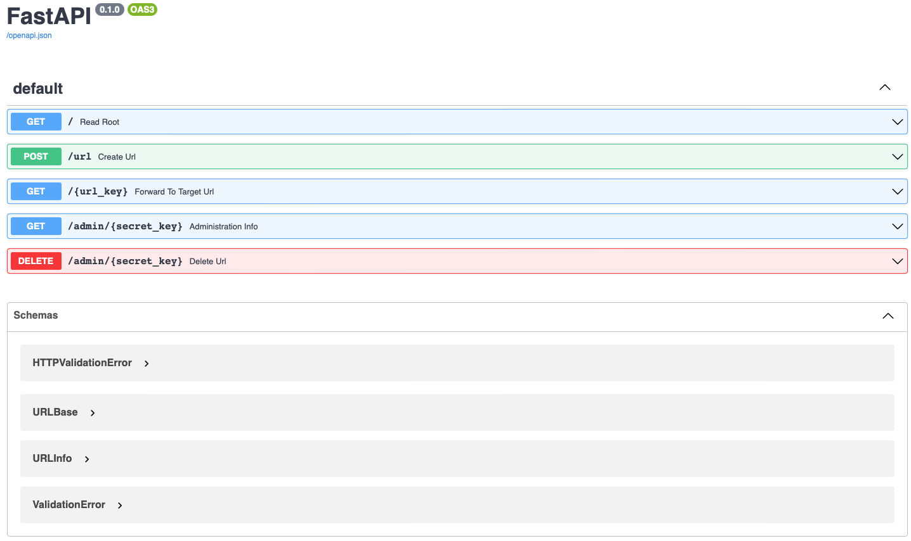

# Project Title:

URL Shortener With FastAPI and Python


## 1. What is the project?

In this tutorial, we have built a fully functional FastAPI-driven Python web app that creates shortened URLs that forward to target URLs. URLs can be extremely long and not user-friendly. This is where a URL shortener can come in handy. A URL shortener reduces the number of characters in a URL, making it easier to read, remember, and share.


## 2. Tech Stack:

- Swagger UI
- Python 3
- FastAPI
- SQLite
- SQLAlchemy
- Uvicorn server

## 3. Project Dependencies:

 - Installation(s)
```
(venv) $ python -m pip install fastapi==0.75.0 uvicorn==0.17.6
(venv) $ python -m pip install sqlalchemy==1.4.32
(venv) $ python -m pip install python-dotenv==0.19.2
(venv) $ python -m pip install validators==0.18.2
```

- .env file

```
ENV_NAME="XXXXXXXX"
BASE_URL="http://127.0.0.1:XXXX"
DB_URL="sqlite:///./XXXXXXXXXX.db"
```


## 4. Installing:

i. Clone the git repo

```
https://github.com/AAdewunmi/URL-Shortener-FastAPI-Python.git
```

ii. Open project folder

iii. Explore

😎


## 5. How To Use:

i. Open project in preferred IDE. I'm using PyCharm.

ii. Run the live server using uvicorn.

```commandline
(venv) $ uvicorn shortener_app.main:app --reload
```

- Create SQLite database

> When the server restarted, sqlalchemy automatically created your database in the location that you defined in your DB_URL environment variable. If you used sqlite:///./shortener.db as the value of DB_URL, then there should be a file named shortener.db in the root directory of your project now. That’s your SQLite database!

iii. Open "http://127.0.0.1:8000/docs" in any web browser


## 6. Demo:




## 7. Contributing:

Pull requests are welcome. For major changes, please open an issue first to discuss what you would like to change.


## 8. Original Creator:

Author: Philipp Acsany

URL: https://realpython.com/build-a-python-url-shortener-with-fastapi/#demo-your-python-url-shortener

Date: 18 May, 2022
